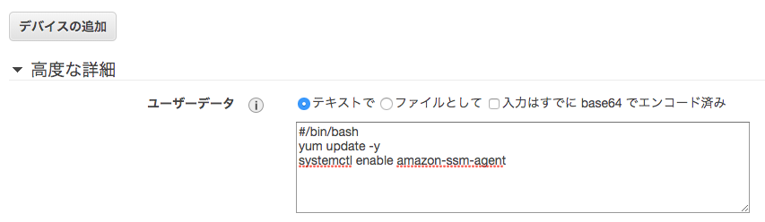

# ec2
## EBS
- EBS暗号化はパフォーマンスに影響しない
- 
## 起動時にSSMを使えるようにする
### Amazon Linux2の場合
- インスタンス作成時に、ユーザーデータから`ssm-agent`を起動するようにする


  - ec2の起動は以下のようにしましょう
```
#!/bin/bash
yum update -y
systemctl enable amazon-ssm-agent
timedatectl set-timezone Asia/Tokyo

yum -y install httpd.x86_64 
systemctl enable httpd
systemctl start httpd

```
- そのほかに以下を忘れないよう設定する
  - IAMロールには、`AmazonEC2RoleforSSM`を付与したロールをつけておく
  - EIPを付与する。もしくは、ゲートウェイを作成し、SSMサービスと通信できるようにする
  
### Amazon Linux2以外は以下を参照
- [Amazon EC2 Linux インスタンスに SSM エージェント を手動でインストールする](https://docs.aws.amazon.com/ja_jp/systems-manager/latest/userguide/sysman-manual-agent-install.html)